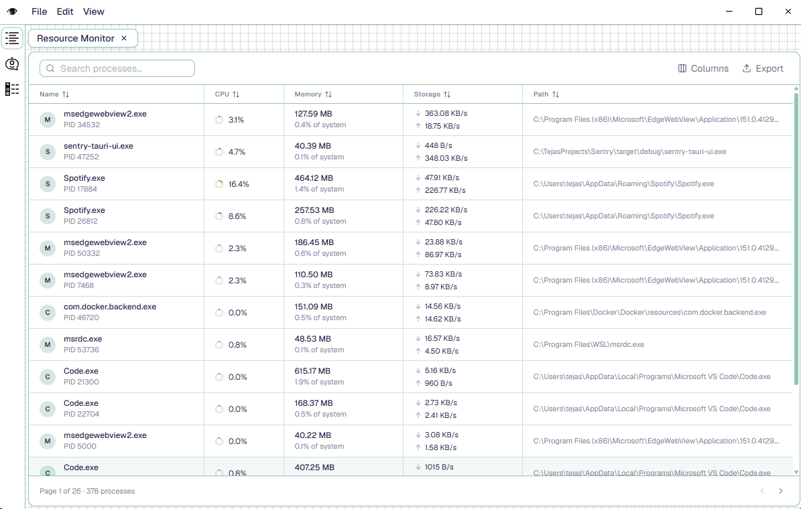
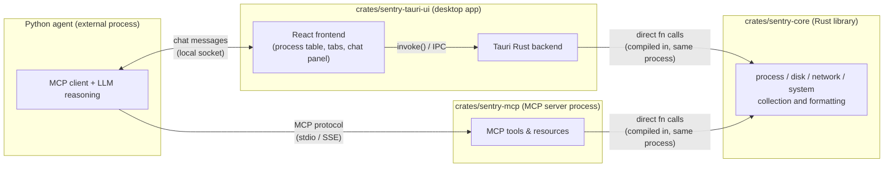

# Sentry — Keeping Tabs



Sentry is a desktop system monitor. It shows running processes, CPU, memory,
disk, and network activity in a native window, and it is built so that an AI
agent can observe and act on the same data an operator sees on screen.

The workspace is three Rust crates plus one external component:

| Crate / component | What it is |
| --- | --- |
| `crates/sentry-core` | Plain Rust library. Wraps `sysinfo` and shapes raw OS data into table-ready rows (processes, disks, network interfaces, system summary). No I/O, no server, no UI — just data collection and formatting. |
| `crates/sentry-tauri-ui` | The desktop app. A Tauri (Rust) shell hosting a React/TypeScript frontend. Renders the process table, tabs, and chat panel. |
| `crates/sentry-mcp` | An MCP (Model Context Protocol) server. Exposes the same system data as MCP tools/resources so an external agent can query and act on it. |
| Python agent (external) | Not part of this workspace. An MCP client that reasons over the exposed tools and drives the chat panel in the desktop app. |

## Architecture



Two independent binaries — the Tauri app and the MCP server — each statically
link `sentry-core` and call it as an ordinary Rust library. Neither depends
on the other, and neither depends on the agent being present. The Python
agent is the only piece that reaches `sentry-core`'s data indirectly, over
the MCP protocol, because it isn't Rust and can't link the crate directly.

The chat panel inside the desktop app and the MCP tool-calling channel are
deliberately separate connections. Chat is presentation: the agent sends and
receives conversational messages with the UI over a local socket. Tool
calls are the agent reading/acting on system state through MCP. Keeping
these apart means the monitoring UI works with zero network dependency even
when no agent is running, and the agent can be swapped, restarted, or
removed without touching how the desktop app reads process data.

## How this differs from typical services

A conventional monitoring product usually puts a network API between the UI
and the logic that reads system state: the frontend calls a REST or
GraphQL endpoint, a backend service resolves it, and that service is a
separate deployable that has to be running, versioned, and kept alive
independently of the client. Every read of "what's my CPU usage" pays a
serialization and IPC-over-the-network cost, and the backend has to exist
before the UI is useful at all.

Here, `sentry-core` is not a service — it's a library with no network
surface. The desktop app's own UI never needs a server: the Tauri backend
calls straight into `sentry-core` in-process, so the "backend" for the
monitoring UI is just function calls inside the same binary. The MCP server
exists for exactly one reason: giving a non-Rust agent a language-agnostic
way to reach the same logic. It's optional infrastructure for automation,
not a dependency of the product itself. If the agent and MCP server are
never started, the desktop app still shows live system data.

## Layout

```
crates/
  sentry-core/       system data collection (library, no dependents required)
  sentry-mcp/        MCP server exposing sentry-core as tools/resources
  sentry-tauri-ui/   Tauri + React desktop app
    src/             React frontend
    src-tauri/       Rust backend (Tauri commands, window chrome)
```
