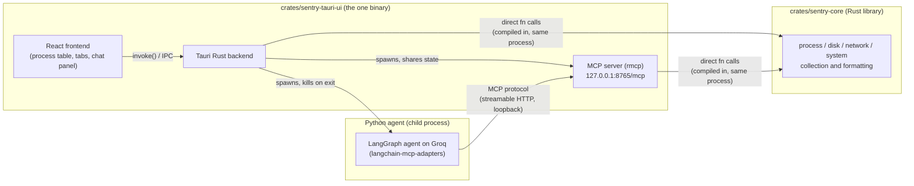

# Sentry — Keeping Tabs


Sentry is a desktop system monitor. It shows running processes, CPU, memory,
disk, and network activity in a native window, and it is built so that an AI
agent can observe and act on the same data an operator sees on screen.

The workspace is two Rust crates plus one external component:

| Crate / component | What it is |
| --- | --- |
| `crates/sentry-core` | Plain Rust library. Wraps `sysinfo` and shapes raw OS data into table-ready rows (processes, disks, network interfaces, system summary), plus four SQLite-backed stores (recorded history, chat spaces, tracked-process sessions, MCP client/tool-call usage). No network server, no UI — just data collection, persistence, and formatting. |
| `crates/sentry-tauri-ui` | The desktop app. A Tauri (Rust) shell hosting a React/TypeScript frontend. Renders the process table, tabs, and chat panel — and hosts the MCP server in-process (`src-tauri/src/mcp/`). |
| Python agent (external) | Not part of this workspace. A LangChain/LangGraph agent running on Groq that connects to the desktop app's MCP endpoint, reasons over the exposed tools, and writes replies back into the chat panel. |

## Architecture



There is exactly one Rust binary. The Tauri app statically links `sentry-core`
and calls it as an ordinary Rust library, and it also hosts the MCP server in
the same process — so the tools an agent calls read and mutate the very same
stores the on-screen UI is rendering, with no cross-process synchronization.
The Python agent is the only piece that reaches `sentry-core`'s data
indirectly, over the MCP protocol, because it isn't Rust and can't link the
crate directly.

The app owns the agent's lifetime: it launches it once the MCP server is
listening and kills it on exit, so nothing has to be started by hand. Every
agent channel runs over that one MCP connection — tool calls for reading and
acting on system state, chat tools for writing replies into the chat panel,
and a config tool the agent polls to pick up the model chosen in the UI.

None of that is load-bearing for the monitoring UI. It reads `sentry-core`
through direct function calls and never waits on the MCP server, so the
process table, charts and history work identically whether the agent is
running, crashed, or never installed. What breaks without an agent is exactly
one thing: chat messages go unanswered, and the panel says so rather than
spinning.

## How this differs from typical services

A conventional monitoring product usually puts a network API between the UI
and the logic that reads system state: the frontend calls a REST or
GraphQL endpoint, a backend service resolves it, and that service is a
separate deployable that has to be running, versioned, and kept alive
independently of the client. Every read of "what's my CPU usage" pays a
serialization and IPC-over-the-network cost, and the backend has to exist
before the UI is useful at all.

Here, `sentry-core` is not a service — it's a library with no network
surface. The desktop app's own UI never needs a server: the Tauri backend
calls straight into `sentry-core` in-process, so the "backend" for the
monitoring UI is just function calls inside the same binary. The MCP server
exists for exactly one reason: giving a non-Rust agent a language-agnostic
way to reach the same logic. It's optional infrastructure for automation,
not a dependency of the product itself — it listens on loopback, and if no
agent ever connects, the desktop app still shows live system data.

## Layout

```
crates/
  sentry-core/       system data collection (library, no dependents required)
  sentry-tauri-ui/   Tauri + React desktop app — the only binary
    src/             React frontend
    src-tauri/       Rust backend (Tauri commands, window chrome)
      src/mcp/       MCP server exposing sentry-core as tools, served in-process
agent/               external LangGraph agent (Python, not in the Cargo workspace)
```

## The MCP server

Built on [`rmcp`](https://crates.io/crates/rmcp), started from the Tauri app's `setup` hook
and served over Streamable HTTP at `http://127.0.0.1:8765/mcp`, with a WebSocket alongside it
at `/events`.

The two directions are separate on purpose. MCP is request/response — the agent calls, the
app answers — which leaves no way for the app to say *a user just sent a message*. The
WebSocket carries that direction: new chat messages, model changes, and stop requests. It is
also how each side knows the other is alive, since the socket closes the instant either
process dies, including on a crash where no shutdown path runs. Nothing anywhere polls.

That port is fixed with no fallback. Clients hardcode the address, so quietly binding
somewhere else when it's occupied would leave every one of them failing to connect against a
server that looks healthy; failing to bind is reported instead, which is diagnosable. A
second instance of the app therefore runs without an MCP server or agent, and says so — the
monitoring UI is unaffected either way.

22 tools, in six groups:

| Group | Tools |
| --- | --- |
| System | `get_system_summary`, `list_processes`, `find_processes`, `get_process_details`, `list_disks`, `list_networks`, `list_components` |
| History | `get_system_timeline`, `get_process_timeline` |
| Tracking | `start_tracking`, `list_tracked_processes`, `end_tracking`, `get_tracked_archive`, `delete_tracked_process` |
| Chat | `list_chat_spaces`, `get_chat_space`, `create_chat_space`, `post_assistant_message`, `post_error_message`, `post_thinking_step` |
| Config | `get_agent_config` |
| Action | `kill_process` |

Two constraints shape that surface:

**Results are sized for a context window.** `sentry-core`'s types are built for a UI table —
every numeric field paired with a pre-formatted `_display` string, and a snapshot carrying
every process on the machine. Returned raw, one `list_processes` call on a normal desktop is
~360 processes of ~30 fields each. So list tools project down to the fields an agent reasons
over and paginate (20 by default), and history tools bucket-average to `max_points` (120 by
default) — a 24h query would otherwise return ~43,200 samples.

**`kill_process` is guarded.** Callers pass `expect_name` alongside the pid; the server
refreshes that pid and refuses if the name no longer matches, which is what stops a recycled
pid from redirecting a kill onto an unrelated process. Critical OS processes and Sentry's own
pid are refused outright unless `force` is set.

### Knowing who's calling


Any MCP client can connect — the bundled Python agent, Claude Code, Claude Desktop, or
anything else pointed at the loopback endpoint — so every tool call is recorded: which client
made it, on which tool, from which OS process, and whether it succeeded. Two independent
signals identify the caller, since either alone can be uninformative:

- **The MCP handshake's `clientInfo`.** Not always meaningful on its own — some clients (the
  bundled agent's `mcp` Python SDK, and even Claude Code's own Rust MCP client) report their
  underlying library's name rather than the app's, so a denylist of known-generic values falls
  back to the second signal instead of keying every such client under the same meaningless
  string.
- **The OS process behind the connection.** Both ends of a loopback TCP connection are local
  sockets, so the OS's own connection table can resolve the client's ephemeral port to a pid,
  and from there to a process name and command line.

This is app-internal telemetry, not something an agent can read over MCP — it's exposed only
through Tauri commands, surfaced in the desktop app's **MCP Clients** sidebar panel: one entry
per distinct client, opening a tab with that client's full tool-call history.

### Watching a turn happen

A turn that reads several tools takes long enough that an unexplained spinner is the wrong
thing to show. The agent runs the graph with `astream(stream_mode="updates")` and reports
each step through `post_thinking_step` as it happens — the model's own reasoning where the
provider exposes it, then each tool call and result. The panel shows the newest step live
with the trail of finished ones beneath it.

Steps are **never written to the database**. They describe work in progress, so once the
reply lands they are scaffolding: keeping them purely in flight means the final answer
replaces them with no cleanup, and reopening the conversation later shows the answer rather
than a log of how it was reached.

The reply itself is markdown, rendered with `react-markdown` — tables, code, and links get
the app's own components rather than a typography preset.

### A turn always ends

A chat turn runs in another process, so it can fail or wedge somewhere the UI cannot see.
Three things close that off, and each writes a real message into the transcript rather than
leaving the panel waiting:

- **The agent fails.** It posts the cause via `post_error_message`, shown with the full trace
  behind a "View details" disclosure.
- **The agent is down.** The app knows, because the WebSocket is gone, and the pending state
  says so instead of spinning.
- **The agent hangs.** A stop button appears while a reply is outstanding. The app writes
  `Process interrupted.` itself and pushes a cancel to the agent — writing it locally is what
  makes stop work in the case it exists for, where the agent isn't answering. The agent runs
  turns as cancellable tasks precisely so it is still reading its socket while one is in
  flight; awaiting a turn inline would mean the stop couldn't arrive until the turn it was
  stopping had already finished.

## The agent

A LangGraph agent whose tools are loaded from the MCP server at runtime, so a tool added on
the Rust side reaches it with no Python change. Models are served by Groq.

**The desktop app launches it for you.** Once the MCP server is listening, the app spawns
`agent/app.py --serve` and kills it on exit, so the chat panel works with nothing to start by
hand. Two independent guards keep it from outliving the app: the app kills it on shutdown,
and the agent exits on its own after ~20s of not reaching the MCP server — which covers the
crash and force-kill paths where no shutdown hook ever runs.

Setup is just the dependencies and a key:

```bash
cd agent
pip install -r requirements.txt
cp .env.example .env                  # then put your GROQ_API_KEY in it
```

Running it by hand is for development and one-off questions:

```bash
python app.py --list-tools            # what the server exposes (no API call)
python app.py --list-models           # what you can run it on
python app.py --ask "what's using the most CPU?"
python app.py --serve                 # what the desktop app runs
```

```
agent/
  app.py                  entry point
  sentry_agent/
    config.py             constants and the system prompt
    models.py             model registry, resolution, construction
    tools.py              the MCP connection and direct tool calls
    agent.py              the LangGraph agent and its hot-swappable model
    chat_bridge.py        answering messages from the app's chat panel
    cli.py                argument parsing and entry point
```

Each chat space maps to its own LangGraph thread, so conversations keep their history without
replaying the transcript every turn.

### Switching models

| Key | Model |
| --- | --- |
| `gpt-oss` | `openai/gpt-oss-120b` |
| `gpt-oss-20b` | `openai/gpt-oss-20b` |
| `qwen` | `qwen/qwen3.6-27b` (the app's default) |
| `llama` | `llama-3.3-70b-versatile` |

**The model picker in the chat composer is the control.** Changing it records the choice with
the backend; the running agent reads it back over MCP on its next poll and swaps in place, so
switching models mid-conversation costs nothing and keeps the thread's history. Nothing
restarts.

Standalone runs take `--model qwen` or the `SENTRY_AGENT_MODEL` env var instead, and accept
any Groq model id so a model Groq adds tomorrow works without waiting for the registry. When
the desktop app is driving, its picker wins.

Any MCP client can connect, not just this agent — to use it from Claude Code, add to
`.mcp.json`:

```json
{ "mcpServers": { "sentry": { "url": "http://127.0.0.1:8765/mcp", "type": "http" } } }
```
