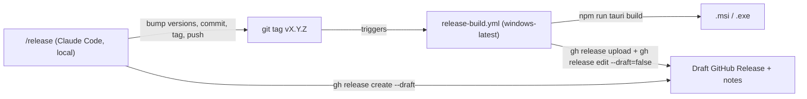

# Release architecture

How a release of the System-Expert desktop app gets cut, who writes what, and why
it's split the way it is.

## Summary



Two halves, deliberately kept separate:

- **`/release` — a Claude Code skill, run locally.** Decides the version,
  writes the release notes, bumps every version file, commits, tags, pushes,
  and creates a **draft** GitHub Release with those notes.
- **`.github/workflows/release-build.yml` — CI, triggered by the tag push.**
  Builds the Windows installer on a real Windows runner and attaches it to
  that draft release, then publishes it.

## Why a skill instead of a CI-side Claude Code Action

The obvious alternative — a `claude-code-action` step inside the GitHub
workflow, given a `git log` and asked to write notes — was the first design
considered here. It was dropped for a more direct reason: **the Claude Code
session that just built the feature already has the context** a CI job would
have to reconstruct from commit messages and diffs alone. Writing the notes
locally, as `/release`, is both cheaper (no `ANTHROPIC_API_KEY`/OAuth secret
or extra API calls in CI) and better (it can describe *why* something like
the Track page's charts or the chat delete flow works the way it does,
not just that files changed).

This also means `release-build.yml` needs no Anthropic credentials at all —
it's a plain build-and-upload job authenticated with the default
`GITHUB_TOKEN`.

## Why a draft release, not a direct publish

The skill creates the release as a **draft** before any installer exists.
Draft releases aren't visible to the public — only repo collaborators can
see them — so there's never a window where a release is visible with no
downloadable installer attached. `release-build.yml` is what flips
`--draft=false`, and only after `gh release upload` has succeeded. If the
Windows build fails partway, the draft just sits there until it's re-run
(`workflow_dispatch` with the `tag` input) — nothing broken ships.

## Version sync

Versions used to live independently in five files, all coincidentally
`0.1.0`:

- `crates/system-expert-core/Cargo.toml`
- `crates/system-expert-tauri-ui/src-tauri/Cargo.toml`
- `crates/system-expert-tauri-ui/src-tauri/tauri.conf.json` (`"version"`)
- `crates/system-expert-tauri-ui/package.json`

Two changes collapse that to two commands:

- `tauri.conf.json`'s `"version"` now points at `"../package.json"` (a value
  Tauri reads natively) instead of holding its own copy.
- The skill runs `cargo set-version --workspace <version>` (via
  [`cargo-edit`](https://github.com/killercup/cargo-edit)) to bump the two
  Rust crates in one shot, and `npm version <version> --no-git-tag-version`
  inside `crates/system-expert-tauri-ui` to bump `package.json` (which
  `tauri.conf.json` now inherits from).

## Trigger design

`release-build.yml` triggers on any `v*` tag push — which is exactly what
the skill does at the end of its run — plus a `workflow_dispatch` fallback
with a `tag` input, for re-running a build that failed without needing to
push a new tag. There's no automatic trigger on every commit or PR merge:
releases are cut deliberately, whenever a batch of work is ready, by running
`/release`.

## Runbook

```
/release
```

That's it. The skill walks through confirming the version with you, shows
you the notes before pushing anything, and reports back once the tag is
pushed. Watch the build at:

```
gh run list --workflow=release-build.yml -L 1
```
